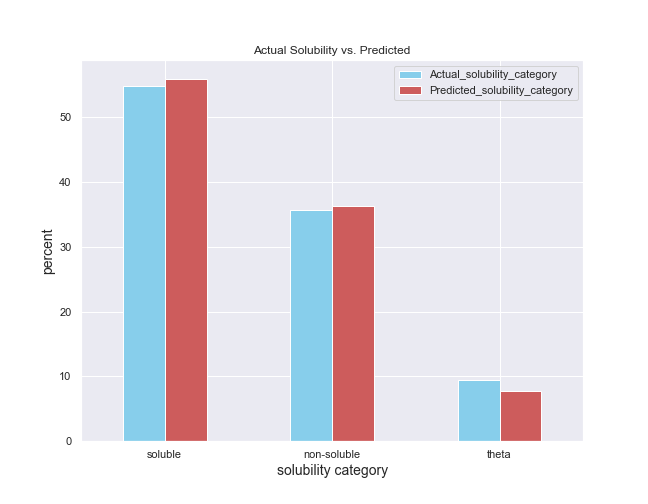

# dissolve_me

 ----------------------------------
# Polymers - Solvents Solubility Modeling
 ----------------------------------
 
 #####  The algorithm attempts to model a solubility of plastic materials in various organic solvents or to demonstrate what plastic materials can be dissolved / not dissolved by a certain organic solvent, based on the solute-solvent molecular formulas. The algorithm is using Deep Neural Network modeling. 
 
 - The solubility was divided into three major categories: soluble, 'theta' condition for a neutral interaction (as swollen and/or strongly swollen, slight solubility), and non-soluble. 

 - This datasets are originally from HSP Book, transformed into csv file.

 - The datasets consist of several variables (elements and their number in a solute and in a solvent molecules) and one target variable (solubility parameter).
 
 Example of the model outcome vs. actual solubility
 
 

